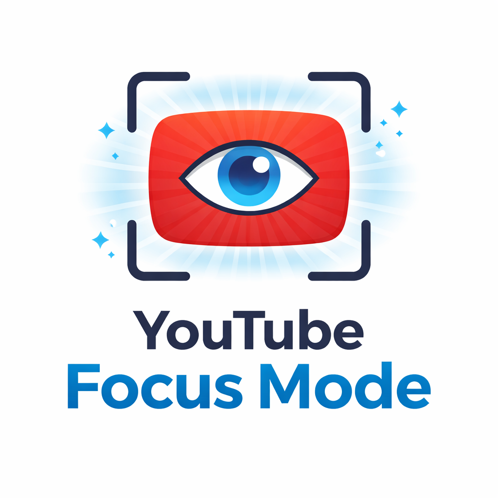

<p align="center">
  
</p>

<h1 align="center">YouTube Focus Mode</h1>

<p align="center">
  <strong>Stay focused. Watch intentionally.</strong>
</p>

<p align="center">
  A free Chrome extension that blurs distracting YouTube recommendations so you can focus on what matters.
</p>

<p align="center">
  <a href="https://x.com/MuktharBuilds">
    
  </a>
  
  
  
</p>

---

## The Problem

YouTube's algorithm is designed to keep you watching. The homepage and sidebar are filled with recommended videos that pull you into endless rabbit holes of content you never planned to watch.

**YouTube Focus Mode** solves this by blurring distracting content, letting you:
- Search for specific videos without getting sidetracked
- Watch what you came for, not what the algorithm wants
- Build healthier digital habits
- Stay productive while using YouTube for learning

## Features

| Feature | Description |
|---------|-------------|
| **Homepage Blur** | Blurs all video thumbnails and titles on the YouTube homepage |
| **Sidebar Blur** | Hides the "Up Next" and recommended videos while watching |
| **End Screen Blur** | Blurs video suggestions that appear at the end of videos |
| **Shorts Blur** | Blurs the Shorts shelf on the homepage |
| **One-Click Toggle** | Easily enable/disable with a single click |
| **Instant Apply** | Changes take effect immediately, no refresh needed |

## What Stays Visible

- Search bar (always accessible)
- The video you're currently watching
- Video title, description, and channel info
- Comments section
- Your subscriptions page
- Search results
- Playlists and Watch Later
- Channel pages

## Installation

### From Source (Developer Mode)

1. Download or clone this repository
2. Open Chrome and go to `chrome://extensions/`
3. Enable **Developer mode** (toggle in top-right corner)
4. Click **Load unpacked**
5. Select the `hide yt suggestions` folder
6. Done! The extension is now active

### From Chrome Web Store

*Coming soon*

## Usage

1. **Visit YouTube** - The extension activates automatically
2. **Click the extension icon** - Opens the control popup
3. **Toggle on/off** - Use the switch to enable or disable blur
4. **Search normally** - The search bar is always visible
5. **Watch focused** - Enjoy your video without distractions

## Screenshots

### Homepage with Focus Mode ON
The homepage videos are blurred, but search remains accessible.

### Video Page with Focus Mode ON
Watch your video without getting distracted by the sidebar recommendations.

## Privacy

This extension:
- **Collects NO data** - Zero tracking, zero analytics
- **Makes NO network requests** - Everything runs locally
- **Has NO backend** - Completely client-side
- **Stores only ONE setting** - Your on/off preference (locally)

## Tech Stack

- Chrome Extension Manifest V3
- Vanilla JavaScript
- CSS (blur filters)
- Chrome Storage API (local)

## Project Structure

```
hide yt suggestions/
├── manifest.json           # Extension configuration
├── background/
│   └── service-worker.js   # Background service worker
├── content/
│   ├── content.css         # Blur styles
│   └── content.js          # Content script
├── popup/
│   ├── popup.html          # Popup UI
│   ├── popup.css           # Popup styles
│   └── popup.js            # Popup logic
├── icons/                  # Extension icons
├── logo.png                # Project logo
├── README.md               # This file
└── PRD.md                  # Product requirements document
```

## Contributing

Contributions are welcome! Feel free to:
- Report bugs
- Suggest features
- Submit pull requests

## Support

If you find this extension helpful:
- Star this repo
- Share it with others who struggle with YouTube distractions
- Follow me on X for more projects

<p align="center">
  <a href="https://x.com/MuktharBuilds">
    
  </a>
</p>

## License

MIT License - Feel free to use, modify, and distribute.

---

<p align="center">
  Made with focus by <a href="https://x.com/MuktharBuilds">@MuktharBuilds</a>
</p>
